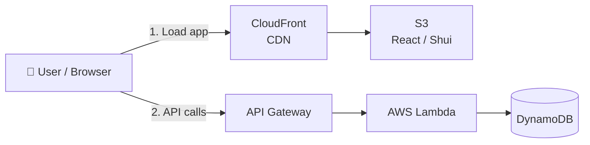

<div align="center">

# 📌 Shui

**A serverless digital notice board where users can publish, edit, and delete messages.**

</div>

---

## 📖 About

Shui is a simple digital notice board. Anyone can jump in and read the messages, but you need an account to publish, edit, or delete your own posts.

For this individual exam, I took an existing React frontend and built a completely serverless backend for it from scratch. The entire stack is hosted on AWS.

---

## 🌐 Live Links

| What                | Link                                                    |
| :------------------ | :------------------------------------------------------ |
| 🖥 **Frontend**     | https://d2cxonnul7ilal.cloudfront.net/                  |
| 🔌 **API Base URL** | https://vtclqnyxak.execute-api.eu-north-1.amazonaws.com |

---

## 🧰 Tech Stack

| Layer          | Technology                                       |
| :------------- | :----------------------------------------------- |
| Frontend       | React, React Router, Zustand, React Query, Axios |
| Backend        | Node.js, AWS Lambda, API Gateway, Middy          |
| Database       | Amazon DynamoDB (`@aws-sdk/lib-dynamodb`)        |
| Infrastructure | Serverless Framework (`serverless.yml`)          |
| Hosting        | Amazon S3 + CloudFront (CDN), GitHub Actions     |
| Auth (VG)      | JWT (`jsonwebtoken`) + bcryptjs                  |
| Validation     | Zod                                              |

---

## 🏗 Architecture



**How it works**

1. CloudFront serves the static React build from the `shui-frontend-jonathan` S3 bucket.
2. The frontend makes HTTP calls to API Gateway, which routes the requests to specific Lambda functions. These functions handle the business logic and interact with the `notice-board-table` in DynamoDB.

Example flow for publishing a message:

```text
Message Form → POST /api/posts → API Gateway → Lambda → DynamoDB → Frontend updates
```

---

## ✨ Features

- [x] View all messages
- [x] View messages from a specific user
- [x] Publish a new message
- [x] Edit a message
- [x] Delete a message
- [x] Dedicated user pages (`/?username={username}`)
- [x] Registration & JWT login
- [x] Authorization (only authors can touch their own posts)

---

## 🗂 Project Structure

```text
.
├── .github/workflows/     # CI/CD pipeline for S3/CloudFront
├── frontend/              # React app
│   ├── src/
│   │   ├── api/           # Axios endpoints
│   │   ├── components/    # Reusable UI parts
│   │   ├── pages/         # Route views
│   │   ├── router/        # React Router config
│   │   └── stores/        # Zustand global state
│   └── package.json
├── backend/               # Serverless API
│   ├── functions/         # Lambda handlers
│   ├── middlewares/       # Middy wrappers (auth, validation)
│   ├── models/            # Zod schemas
│   ├── responses/         # API response formatting
│   ├── services/          # DynamoDB logic
│   ├── utils/             # JWT & bcrypt helpers
│   └── serverless.yml     # Infrastructure setup
└── README.md
```

---

## 🔧 Running Locally

To run the project locally, you only need to start the React frontend—it connects directly to the live serverless API hosted on AWS.

### Prerequisites

- Node.js 22+
- npm

### 1. Clone & Navigate

```bash
git clone https://github.com/NorthernGambit/cloud-individual.git
cd cloud-individual/frontend
```

### 2. Install Dependencies

```bash
npm install
```

### 3. Environment Setup

Create a `.env` file in the `frontend/` directory and configure the base API URL:

```env
VITE_API_BASE_URL=https://vtclqnyxak.execute-api.eu-north-1.amazonaws.com
```

### 4. Start the Dev Server

```bash
npm run dev
```

Open [http://localhost:5173](http://localhost:5173) in your browser to view the application.

---

## 📘 API Documentation

**Base URL:** `https://vtclqnyxak.execute-api.eu-north-1.amazonaws.com`

Endpoints marked with 🔒 require a valid JWT in the `Authorization` header:

```http
Authorization: Bearer <token>
```

> All requests and responses communicate using JSON. Make sure to send `Content-Type: application/json` on requests containing a body.

---

### 🗺 Endpoint Overview

| Method   | Path                 | Auth | Description                                       |
| :------- | :------------------- | :--: | :------------------------------------------------ |
| `POST`   | `/api/auth/register` |  —   | Register a new user                               |
| `POST`   | `/api/auth/login`    |  —   | Log in and receive a JWT                          |
| `GET`    | `/api/posts`         |  —   | Fetch all posts (optionally filtered by username) |
| `GET`    | `/api/me/posts`      |  🔒  | Fetch all posts authored by the logged-in user    |
| `GET`    | `/api/posts/{id}`    |  —   | Fetch a single post by ID                         |
| `POST`   | `/api/posts`         |  🔒  | Publish a new post                                |
| `PATCH`  | `/api/posts/{id}`    |  🔒  | Update a post (author only)                       |
| `DELETE` | `/api/posts/{id}`    |  🔒  | Delete a post (author only)                       |

---

### 🔐 Authentication

#### Register User

Creates a new account.

- **Method & Path:** `POST /api/auth/register`
- **Auth:** None

**Request Body:**

```json
{
	"username": "alice",
	"email": "alice@example.com",
	"password": "supersecretpassword"
}
```

**Response (`201 Created`):**

```json
{
	"success": true,
	"message": "Account successfully registered",
	"user": {
		"username": "alice",
		"email": "alice@example.com",
		"createdAt": "2026-09-30T13:45:00.000Z"
	}
}
```

---

#### Login User

Logs in with either a username or an email address to receive a signed JWT.

- **Method & Path:** `POST /api/auth/login`
- **Auth:** None

**Request Body:**

```json
{
	"usernameOrEmail": "alice",
	"password": "supersecretpassword"
}
```

**Response (`200 OK`):**

```json
{
	"success": true,
	"message": "User successfully logged in",
	"token": "eyJhbGciOiJIUzI1NiIsInR5cCI6IkpXVCJ9...",
	"username": "alice"
}
```

---

### 📝 Posts

#### Get All Posts

Fetches all posts globally, or filters posts by a specific user.

- **Method & Path:** `GET /api/posts`
- **Auth:** None
- **Query Parameters:**
    - `username` _(optional)_: Filter posts by author (case-insensitive).

```http
GET /api/posts?username=alice
```

**Response (`200 OK`):**

```json
{
	"success": true,
	"message": "Successfully fetched all posts",
	"posts": [
		{
			"id": "c92842fa-6df3-4c92-a1f9-7157833be2d0",
			"username": "alice",
			"text": "Anyone up for padel tonight?",
			"createdAt": "2026-09-30T13:45:00.000Z"
		}
	]
}
```

---

#### Get Current User's Posts

Fetches all posts authored by the currently authenticated user.

- **Method & Path:** `GET /api/me/posts`
- **Auth:** 🔒 Required

**Response (`200 OK`):**

```json
{
	"success": true,
	"message": "Successfully fetched all posts for the current user",
	"posts": [
		{
			"id": "c92842fa-6df3-4c92-a1f9-7157833be2d0",
			"username": "alice",
			"text": "Anyone up for padel tonight?",
			"createdAt": "2026-09-30T13:45:00.000Z"
		}
	]
}
```

---

#### Get Single Post

Fetches a specific post by its unique ID.

- **Method & Path:** `GET /api/posts/{id}`
- **Auth:** None

**Response (`200 OK`):**

```json
{
	"success": true,
	"message": "Successfully fetched post with corresponding id",
	"post": {
		"id": "c92842fa-6df3-4c92-a1f9-7157833be2d0",
		"username": "alice",
		"text": "Anyone up for padel tonight?",
		"createdAt": "2026-09-30T13:45:00.000Z"
	}
}
```

---

#### Create Post

Publishes a new message as the logged-in user.

- **Method & Path:** `POST /api/posts`
- **Auth:** 🔒 Required

**Request Body:**

```json
{
	"text": "Anyone up for padel tonight?"
}
```

**Response (`201 Created`):**

```json
{
	"success": true,
	"message": "Post successfully created",
	"post": {
		"id": "c92842fa-6df3-4c92-a1f9-7157833be2d0",
		"username": "alice",
		"text": "Anyone up for padel tonight?",
		"createdAt": "2026-09-30T13:45:00.000Z"
	}
}
```

---

#### Update Post

Updates the text content of an existing post. Only the original author can edit it.

- **Method & Path:** `PATCH /api/posts/{id}`
- **Auth:** 🔒 Required (author only)

**Request Body:**

```json
{
	"text": "Updated: padel is moved to 19:00!"
}
```

**Response (`200 OK`):**

```json
{
	"success": true,
	"message": "Successfully updated post with corresponding id",
	"post": {
		"id": "c92842fa-6df3-4c92-a1f9-7157833be2d0",
		"username": "alice",
		"text": "Updated: padel is moved to 19:00!",
		"createdAt": "2026-09-30T13:45:00.000Z",
		"updatedAt": "2026-09-30T14:10:00.000Z"
	}
}
```

---

#### Delete Post

Deletes a post. Only the original author can delete it. Returns the deleted record.

- **Method & Path:** `DELETE /api/posts/{id}`
- **Auth:** 🔒 Required (author only)

**Response (`200 OK`):**

```json
{
	"success": true,
	"message": "Successfully deleted post with corresponding id",
	"post": {
		"id": "c92842fa-6df3-4c92-a1f9-7157833be2d0",
		"username": "alice",
		"text": "Updated: padel is moved to 19:00!",
		"createdAt": "2026-09-30T13:45:00.000Z"
	}
}
```

---

### 🚨 Error Handling

All failed API requests return a consistent JSON response:

```json
{
	"success": false,
	"message": "Error description here"
}
```

| Status Code | Meaning               | When it occurs                                                      |
| :---------: | :-------------------- | :------------------------------------------------------------------ |
|    `400`    | Bad Request           | Validation failure (e.g. text too short, bad character in username) |
|    `401`    | Unauthorized          | Missing/invalid JWT token or wrong login credentials                |
|    `403`    | Forbidden             | Attempting to update or delete a post that belongs to someone else  |
|    `404`    | Not Found             | Target post ID doesn't exist                                        |
|    `409`    | Conflict              | Registration failed because username or email is already in use     |
|    `500`    | Internal Server Error | Unhandled server or database exceptions                             |

**Common Error Examples:**

- **400 Bad Request**

    ```json
    {
    	"success": false,
    	"message": "Post text needs to be at least 3 characters long"
    }
    ```

- **401 Unauthorized**

    ```json
    {
    	"success": false,
    	"message": "Invalid credentials"
    }
    ```

- **403 Forbidden**

    ```json
    {
    	"success": false,
    	"message": "You do not have permission to modify this post"
    }
    ```

- **404 Not Found**

    ```json
    {
    	"success": false,
    	"message": "No post with corresponding id found"
    }
    ```

- **409 Conflict**
    ```json
    {
    	"success": false,
    	"message": "Username and email are both taken"
    }
    ```

---

## 🗄 DynamoDB Design

Everything is stored in a single DynamoDB table called `notice-board-table` using on-demand billing.

### Access Patterns

Here's how the app asks the database for data:

| #   | Access Pattern                           | Operation    | Key / Index Used                     |
| :-- | :--------------------------------------- | :----------- | :----------------------------------- |
| AP1 | Create a message                         | `PutItem`    | PK: `POST#{id}`, SK: `META`          |
| AP2 | Get all messages                         | `Query`      | GSI2 (`GSI2PK = POSTS`)              |
| AP3 | Get all messages from a specific user    | `Query`      | GSI1 (`GSI1PK = USER#{username}`)    |
| AP4 | Get a specific message by ID             | `GetItem`    | PK: `POST#{id}`, SK: `META`          |
| AP5 | Update a message                         | `UpdateItem` | PK: `POST#{id}`, SK: `META`          |
| AP6 | Delete a message                         | `DeleteItem` | PK: `POST#{id}`, SK: `META`          |
| AP7 | Get user by email (during login)         | `GetItem`    | PK: `EMAIL#{email}`, SK: `EMAIL`     |
| AP8 | Get user by username                     | `GetItem`    | PK: `USER#{username}`, SK: `PROFILE` |
| AP9 | Get all messages from the logged-in user | `Query`      | GSI1 (`GSI1PK = USER#{username}`)    |

### Key Design

| Entity                | PK                | SK        | GSI1PK            | GSI1SK        | GSI2PK  | GSI2SK        | Other Attributes                     |
| :-------------------- | :---------------- | :-------- | :---------------- | :------------ | :------ | :------------ | :----------------------------------- |
| **Message**           | `POST#{id}`       | `META`    | `USER#{username}` | `{createdAt}` | `POSTS` | `{createdAt}` | `text`, `updatedAt`                  |
| **User Profile**      | `USER#{username}` | `PROFILE` | -                 | -             | -       | -             | `email`, `passwordHash`, `createdAt` |
| **Email Reservation** | `EMAIL#{email}`   | `EMAIL`   | -                 | -             | -       | -             | `username`                           |

### Global Secondary Indexes

| Index  | GSI PK                     | GSI SK               | Purpose                                              |
| :----- | :------------------------- | :------------------- | :--------------------------------------------------- |
| `GSI1` | `GSI1PK` (USER#{username}) | `GSI1SK` (createdAt) | Fetching all posts by one user, sorted by date.      |
| `GSI2` | `GSI2PK` (POSTS)           | `GSI2SK` (createdAt) | Fetching a global feed of all posts, sorted by date. |

### Design Rationale

> I used a single table design both to practice it and because the app is really small and it seems pretty logical to use it. For a post I use a simple id for the PK+SK to fetch a specific post. GSI1 is combined with a username on the GSI1PK and a createdAt timestamp on the GSI1SK, this way I can easily fetch all posts from a user that can also be sorted by creation. Same Logic applies to the GSI2 where I use POSTS so i can fetch all posts.
>
> The main user profile saves the username on the PK for easy login and checks of ownership in the API. I also made an email reservation that gets created at registration too that ensures uniqueness (with `ConditionExpression: "attribute_not_exists(PK)"`) and also allows easy login with the email. I also use `TransactWriteCommand` during the registration to write both entries at the same time, to prevent duplicate emails or usernames.

---

## ✅ Validation

I'm using `Zod` alongside `Middy` middleware to validate request bodies before they reach the main Lambda logic.

| Rule                                                                 | Endpoint             |
| :------------------------------------------------------------------- | :------------------- |
| `text` must be a string between 3 and 200 characters                 | Create / Update Post |
| `username` must be 3-16 characters, alphanumeric/hyphens/underscores | Register             |
| `email` must be valid                                                | Register             |
| `password` must be 8-32 characters                                   | Register             |

---

## 👤 Author

Jonathan Andersson
Frontend Developer program – Individual examination, Shui

- GitHub: [@NorthernGambit](https://github.com/NorthernGambit)
